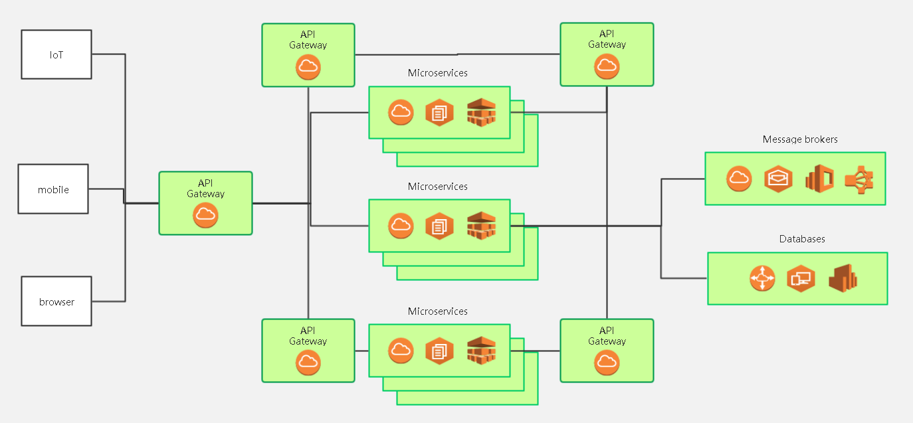

springcloud-config采用cs的架构模式

3344代表服务器
3355代表客户端

客户端通过服务器去获取gitee上面的配置（多个客户端连接服务器，服务器连gitee获取配置给客户端)

这个项目中7001和8001都是采用spirngcloud-config配置的
把原来的application.yml配置简化了
最后application.yml和bootstrap.yml减少了，直接调用了gitee的配置


通过服务端配置文件的 cloud.config.server.git.uri=https://gitee.com/kzj666/springcloud-config.git 属性，连接gitee上的项目，端口号为3344，
服务端可以通过  http://localhost:3344/master/config-client-dev.yml  读取gitee上的 master分支dev环境 的配置文件

客户端通过bootstrap.yml配置文件
```xml
spring:
  cloud:
    config:
      uri: http://localhost:3344        #服务器地址
      name: config-client               #需要从gitee上读取的资源名称
      profile: dev/test                 #dev是开发模式  test是测试模式
      label: master                     #geitee的分支
```
其操作跟服务端一样，就是通过配置，写一个请求地址，可以拿到master分支下dev/test环境的配置文件


图文无关

